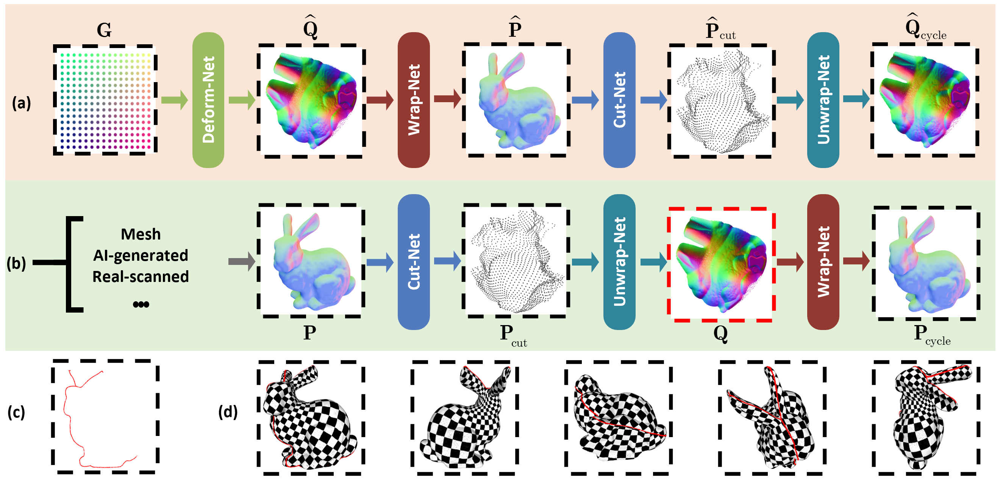
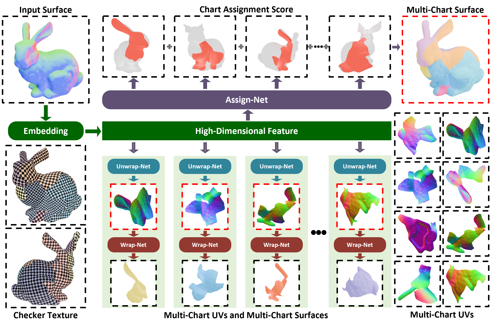

<br />
<p align="center">
    <h1 align="center">
        <a href="https://arxiv.org/abs/2504.19210">FlexPara</a>: Flexible Neural Surface Parameterization
    </h1>

  <p align="center">
    <br />
    <a href="https://aidenzhao.github.io/"><strong>Yuming Zhao</strong></a>
    ·
    <a href="https://keeganhk.github.io/"><strong>Qijian Zhang</strong></a>
    ·
    <a href="https://sites.google.com/site/junhuihoushomepage/"><strong>Junhui Hou</strong></a>
    ·
    <a href="https://www.xiajiazhi.com/"><strong>Jiazhi Xia</strong></a>
    ·
    <a href="https://engineering.tamu.edu/cse/profiles/Wang-Wenping.html"><strong>Wenping Wang</strong></a>
    ·
    <a href="https://personal.ntu.edu.sg/yhe/"><strong>Ying He</strong></a>
  </p>
  
<p align="center">
    <a href='https://arxiv.org/abs/2504.19210'></a>
  </p>

</p>
<br />

This repository contains the official implementation for the paper [FlexPara: Flexible Neural Surface Parameterization](https://arxiv.org/abs/2504.19210). 

<p align="center">  </p>
<p align="center">  </p>
<p align="center">  </p>

We have previously conducted a series of works on **regular 3D geometry representations**. Please refer to the following:
- **[FlattenAnything](https://github.com/keeganhk/FlattenAnything)** for global free-boundary surface parameterization.
- **[RegGeoNet](https://github.com/keeganhk/RegGeoNet)** for large-scale 3D point clouds.
- **[Flattening-Net](https://github.com/keeganhk/Flattening-Net)** for feed-forward point cloud structurization.
- **[SPCV](https://github.com/ZENGYIMING-EAMON/SPCV)** for dynamic 3D point cloud sequences.

## Configuration
```bash
conda create --name FlexPara python=3.9
conda activate FlexPara
pip install torch==1.10.1+cu111 torchvision==0.11.2+cu111 torchaudio==0.10.1 -f https://download.pytorch.org/whl/cu111/torch_stable.html
pip install -r requirements.txt

cd cdbs/CD
python setup.py install

cd ..
cd EMD
python setup.py install
cp build/lib.linux-x86_64-cpython-39/emd_cuda.cpython-39-x86_64-linux-gnu.so .
```

## Instruction
The project is a v0.1 version for fast review now, and we will release the v1.0 version later, including data pre-processing, full evaluation and so on.

**Training:**
```bash
mkdir expt
cd scripts
# Global Parameterization
python train.py 1 ../data/bunny.obj ../expt 1600 10000
# MulitChart Parameterization
python train.py 8 ../data/bunny.obj ../expt 1600 10000
```

**Testing**
```bash
mkdir expt
cd scripts
# Global Parameterization
python test.py ../data/bunny.obj flexpara_global.pth ../expt
# MulitChart Parameterization
python test.py ../data/bunny.obj flexpara_multi_8.pth ../expt
```

## TODO List
+ [ ] data pre-processing
+ [x] environment configuration
+ [x] train code
+ [x] test code (simple version)
+ [ ] test code (full version) 
